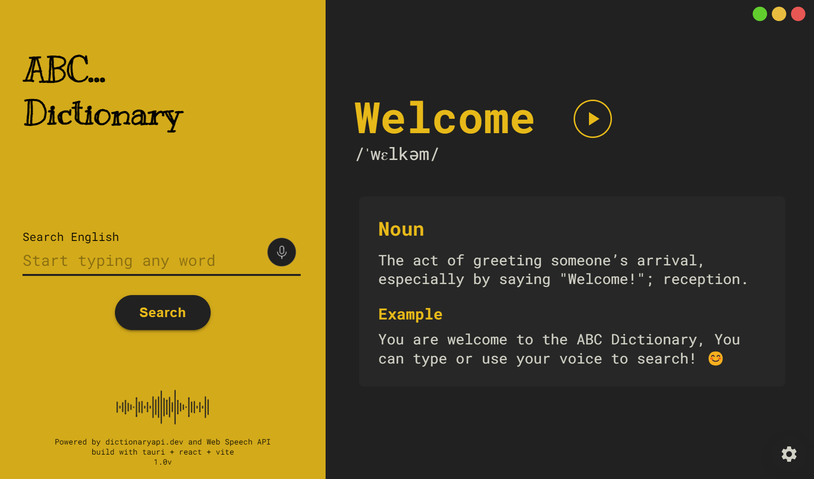
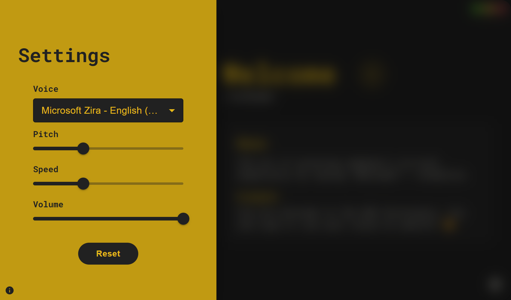

<center>

  
 
 </center>

# ABC Dictionary

**ABC dictionary** is a lightweight and easy-to-use dictionary application built with simplicity in mind. It provides a straightforward interface for looking up word definitions, part of the word, and pronunciations.

## Features

- Voice search
- Listen to audio pronunciations
- Simple and intuitive user interface

## Screenshots


<br/> <br/>


## Download

You can download the program for free from this repo.

- Windows - Download
- Mac/Linux - Coming Soon !

## Used libraries

```
mui
axios
react-lottie
react-hooks-global-state
react-speech-recognition
```